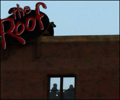

 Until he got home and downloaded the images from his camera, he hadn’t realized that he caught a shot of a couple in a distant window. It was signage he was after – something that’s always intrigued him.

The interesting thing about what he calls driveby photography is that one doesn’t see everything in the shot as they quickly snap it. So here’s this couple in the photo sitting at a table and he imagines what they might be talking about. He decides to look elsewhere for more ideas.

“Okay. I want you to go by impulse and give me the first thing that comes to mind. Imagine a couple sitting at a table in a restaurant or bistro somewhere. They’re on the top floor of the building just below a sign identifying the establishment as ‘The Roof’ – what are they talking about?”

She thinks for only a few seconds.

“Work. They’re talking about work.”

His face gets serious for a moment, then he giggles. He understands.

“Thanks, I think.”

A while passes and he decides to give this thing one more shot. He goes back upstairs.

“Let’s try this again baby. What was the couple talking about?”

With no hesitation, she offers a new answer.

“They were talking about sneaking off to the roof to have sex.”

“Now you’re talking! Happy Anniversary baby.”

Tomorrow marks 30 years (though we’ve been together even longer than that). It’s the little things like fun and second chances (and understanding, of course) that endure over time.

(<a href="https://disqus.com/home/discussion/jenettsimplypersonal/jenettsimplypersonal_the_roof/">prior discussion</a>)
