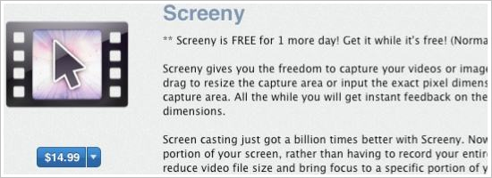

Most of the software I use is not free and I have no problem with that. But when I encounter an app that is of questionable use to me or seems a bit overpriced, I might be encouraged to try it at a special price (including &#8220;free&#8221;). So, I encountered this situation today and just couldn’t trust that the button knows the developer is offering the app for free today. Clicking it would have processed the transaction immediately (there’s no shopping cart to review) and I sure didn’t want to have to follow up on it afterwards if I got charged, so I took a pass. Would you have clicked?