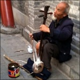

  
Waiting in my inbox this morning was a photo taken by Kim. There, on the other side of the world, sat a blind man playing a stringed instrument. It made me think of several things. Most important, it reminded me how much I miss her when she’s gone. She’ll be home again tomorrow. Yay! 

<!--more-->

It also reminded me how much she and I have in common. Music plays a big part in our lives and had I been on that street in Beijing, I would have taken the very same photo. I think she knew that. I’m sure she knew that. 

I wondered what the instrument was and went looking for the answer. If I’m not mistaken, it’s a three-stringed version of an [Ehru](http://en.wikipedia.org/wiki/Erhu), called the [Sanhu](http://en.wikipedia.org/wiki/Sanhu). 

Finally, that photo in my inbox reminded me to keep playing and writing. I have been working on a new song, _Falling Away_, which is slowly coming together. A brush with death can be a real learning experience and attempting to capture it in words and music has been gratifying. 

Perhaps, more on this soon...