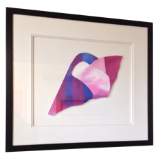

  

      On the wall, the product of a gentle visionary spirit constantly reaches out to impact the moment and help me keep my perspective as to what really matters. Our struggles are similar. We attempt to bring deep dark secrets buried deep within our souls out into the light and sometimes, through the magic of personal expression, we can actually turn the darkness into light.
  

