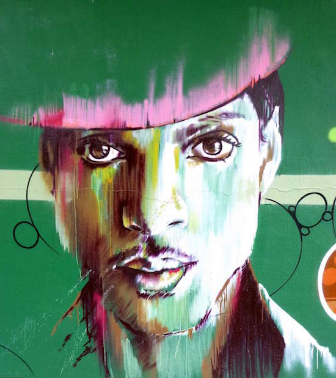

## (we are one)

  
[Photo](https://commons.wikimedia.org/wiki/File:Vitoria_-_Graffiti_%26_Murals_1238.jpg) by Zarateman, [CC BY-SA 4.0](https://creativecommons.org/licenses/by-sa/4.0/deed.en) [[Wikimedia blog](https://blog.wikimedia.org/2016/04/22/prince-death-wikipedia/ "Wikimedia blog")] 

R.I.P. and thank you!