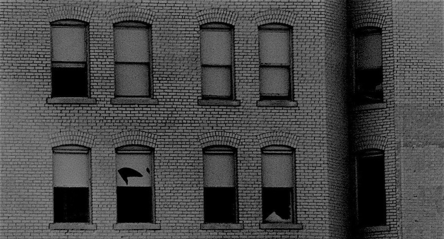

I’ve no shortage of screens around me, each holding worlds of information and ideas with the potential to capture moments of my own creativity. I’ve surely got the tools I need to make a difference in the world but they’re dark at the moment waiting for my next move. One needs to look in a window to see what’s on the other side.

## my wonderful problem

When it’s just me and my guitar, I can improvise some really cool stuff, especially the blues. The joy of creating a song spontaneously makes the words flow out of me in one-off moments of expression like a river disappearing at the horizon. But if I do something in advance intending to capture the music and words, it’s a whole different story. I sit there hesitating and nothing comes out. Maybe I’m just really not that good at planning my creativity. It happens on its own and it seems I’m never quite ready to capture it. One thing precludes the other for me but fortunately, it’s the act of expression that turns me on.

But if I don’t share my creative works with others, there’s no feedback or interaction and the value is greatly diminished. I need to get better at capturing my ideas if sharing is the goal. Doing what I do in a quiet void is like being behind one of those dark windows – no one else will see what’s on the other side unless I start using some of these tools more.

Selling cannot be the goal. If it were, there would be nothing of value for others to see. Creating superficial ideas intended for profit is something I’m just not interested in. I’d rather just stay in the void and keep it real.

## so here I am

For now, I’m self-medicating my need to be creative by making and singing my songs in this quiet place. What it does for me is why I do it but activating a few of those dark screens soon is a real good idea.

(originally published at [𝚓𝚘𝚎.](https://joe.jenett.org/the-dark-windows/))