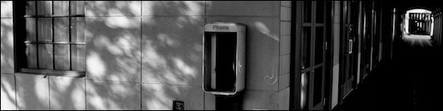

Here we are in this place again. We’re out of date and out of touch as reactionary forces fight to undo the progress we’ve seen.

Fortunately, other forces are still in play where just a short distance from all this chaos, a light from a dark corner reminds us this low point in an ongoing cycle is only temporary. Real change and enlightenment are hard to undo and we’ll still be here after the wrecking crew goes home. I’m not going anywhere. How about you?

I’ll never give up on what I truly believe in. Life’s too short for that.