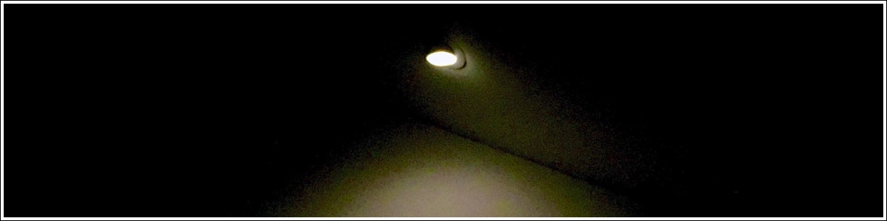

It's been an odd year and all the noise speaks for itself. Enough noise! I'd rather consider the powers of love, truth, and clarity. A collective light struggles to permeate the darkness with the wisdom that madness is not sustainable. Stay with the light and let your actions speak for themselves. The light will make it through and things will change.

### a choice and a wish

For someone like me, it's not always easy to “keep my sunnyside up” especially at this time of year (not to mention in the current political climate). But I want you, my dear friend, to know that I'm choosing to stay positive. The choice to stay with the light is the right choice. 

With all that said, I want to wish you and yours a joyous holiday and hope the new year brings an undeniably blinding light into your lives.