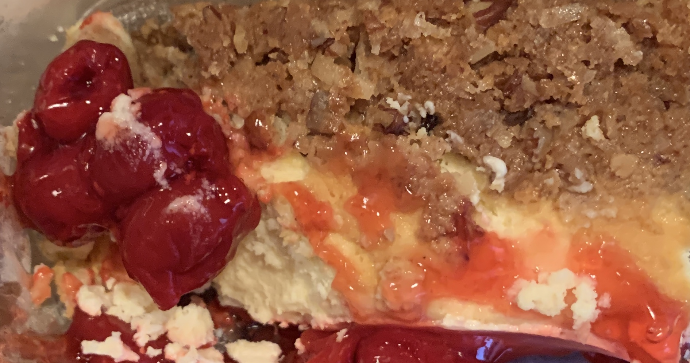

<h2 id="comments-title">6 thoughts on “bliss...”		</h2>

<ol class="commentlist">
<li class="comment even thread-even depth-1 u-comment h-cite h-entry p-comment" id="li-comment-445">
<article id="comment-445" class="comment " itemprop="comment" itemscope="" itemtype="http://schema.org/Comment">
<footer>
<address class="comment-author p-author author vcard hcard h-card" itemprop="creator" itemscope="" itemtype="http://schema.org/Person">
				<cite class="fn p-name" itemprop="name"><a href="https://micro.blog/hollyhoneychurch" rel="external nofollow ugc" class="u-url url">hollyhoneychurch</a></cite> says:					</address>
<!-- .comment-author .vcard -->

<a href="https://micro.blog/hollyhoneychurch/5670930"><time class="updated published dt-updated dt-published" datetime="2019-09-23T11:41:07-04:00" itemprop="datePublished dateModified dateCreated">
September 23, 2019 at 11:41 am						</time></a>

<!-- .comment-meta .commentmetadata -->
</footer>

<a href="https://micro.blog/joejenett" rel="nofollow ugc">@joejenett</a> what am I seeing here? Cherry cheesecake?

<!-- .reply -->
</article><!-- #comment-## -->
</li>
<!-- #comment-## -->
<li class="comment odd alt thread-odd thread-alt depth-1 u-comment h-cite h-entry p-comment" id="li-comment-446">
<article id="comment-446" class="comment " itemprop="comment" itemscope="" itemtype="http://schema.org/Comment">
<footer>
<address class="comment-author p-author author vcard hcard h-card" itemprop="creator" itemscope="" itemtype="http://schema.org/Person">
				<cite class="fn p-name" itemprop="name"><a href="https://micro.blog/hollyhoneychurch" rel="external nofollow ugc" class="u-url url">hollyhoneychurch</a></cite> says:					</address>
<!-- .comment-author .vcard -->

<a href="https://micro.blog/hollyhoneychurch/5670931"><time class="updated published dt-updated dt-published" datetime="2019-09-23T11:41:24-04:00" itemprop="datePublished dateModified dateCreated">
September 23, 2019 at 11:41 am						</time></a>

<!-- .comment-meta .commentmetadata -->
</footer>

<a href="https://micro.blog/joejenett" rel="nofollow ugc">@joejenett</a> raspberry decadence?

<!-- .reply -->
</article><!-- #comment-## -->
</li>
<!-- #comment-## -->
<li class="comment even thread-even depth-1 u-comment h-cite h-entry p-comment" id="li-comment-447">
<article id="comment-447" class="comment " itemprop="comment" itemscope="" itemtype="http://schema.org/Comment">
<footer>
<address class="comment-author p-author author vcard hcard h-card" itemprop="creator" itemscope="" itemtype="http://schema.org/Person">
				<cite class="fn p-name" itemprop="name"><a href="https://micro.blog/joejenett" rel="external nofollow ugc" class="u-url url">joejenett</a></cite> says:					</address>
<!-- .comment-author .vcard -->

<a href="https://micro.blog/joejenett/5671122"><time class="updated published dt-updated dt-published" datetime="2019-09-23T12:18:45-04:00" itemprop="datePublished dateModified dateCreated">
September 23, 2019 at 12:18 pm						</time></a>

<!-- .comment-meta .commentmetadata -->
</footer>

<a href="https://micro.blog/hollyhoneychurch" rel="nofollow ugc">@hollyhoneychurch</a> Indeed – it’s a piece of cherry cheesecake Kim made me for my birthday a few days ago. And it was good! Yummy nums.

<!-- .reply -->
</article><!-- #comment-## -->
</li>
<!-- #comment-## -->
<li class="comment odd alt thread-odd thread-alt depth-1 u-comment h-cite h-entry p-comment" id="li-comment-448">
<article id="comment-448" class="comment " itemprop="comment" itemscope="" itemtype="http://schema.org/Comment">
<footer>
<address class="comment-author p-author author vcard hcard h-card" itemprop="creator" itemscope="" itemtype="http://schema.org/Person">
				<cite class="fn p-name" itemprop="name"><a href="https://micro.blog/hollyhoneychurch" rel="external nofollow ugc" class="u-url url">hollyhoneychurch</a></cite> says:					</address>
<!-- .comment-author .vcard -->

<a href="https://micro.blog/hollyhoneychurch/5671865"><time class="updated published dt-updated dt-published" datetime="2019-09-23T14:14:30-04:00" itemprop="datePublished dateModified dateCreated">
September 23, 2019 at 2:14 pm						</time></a>

<!-- .comment-meta .commentmetadata -->
</footer>

<a href="https://micro.blog/joejenett" rel="nofollow ugc">@joejenett</a> oooooo happy cherry cheesecake birthday!!! 🍰✨🍰✨🍰

<!-- .reply -->
</article><!-- #comment-## -->
</li>
<!-- #comment-## -->
<li class="comment even thread-even depth-1 u-comment h-cite h-entry p-comment" id="li-comment-449">
<article id="comment-449" class="comment " itemprop="comment" itemscope="" itemtype="http://schema.org/Comment">
<footer>
<address class="comment-author p-author author vcard hcard h-card" itemprop="creator" itemscope="" itemtype="http://schema.org/Person">
				<cite class="fn p-name" itemprop="name"><a href="https://micro.blog/joejenett" rel="external nofollow ugc" class="u-url url">joejenett</a></cite> says:					</address>
<!-- .comment-author .vcard -->

<a href="https://micro.blog/joejenett/5671949"><time class="updated published dt-updated dt-published" datetime="2019-09-23T14:27:52-04:00" itemprop="datePublished dateModified dateCreated">
September 23, 2019 at 2:27 pm						</time></a>

<!-- .comment-meta .commentmetadata -->
</footer>

<a href="https://micro.blog/hollyhoneychurch" rel="nofollow ugc">@hollyhoneychurch</a> Why thank you. 😁

<!-- .reply -->
</article><!-- #comment-## -->
</li>
<!-- #comment-## -->
<li class="comment odd alt thread-odd thread-alt depth-1 u-comment h-cite h-entry p-comment" id="li-comment-450">
<article id="comment-450" class="comment " itemprop="comment" itemscope="" itemtype="http://schema.org/Comment">
<footer>
<address class="comment-author p-author author vcard hcard h-card" itemprop="creator" itemscope="" itemtype="http://schema.org/Person">
				<cite class="fn p-name" itemprop="name"><a href="https://micro.blog/smokey" rel="external nofollow ugc" class="u-url url">smokey</a></cite> says:					</address>
<!-- .comment-author .vcard -->

<a href="https://micro.blog/smokey/5685149"><time class="updated published dt-updated dt-published" datetime="2019-09-24T02:56:56-04:00" itemprop="datePublished dateModified dateCreated">
September 24, 2019 at 2:56 am						</time></a>

<!-- .comment-meta .commentmetadata -->
</footer>

<a href="https://micro.blog/joejenett" rel="nofollow ugc">@joejenett</a> That looks amazing. You are a lucky person—and a belated happy birthday to you!

</article></li></ol>