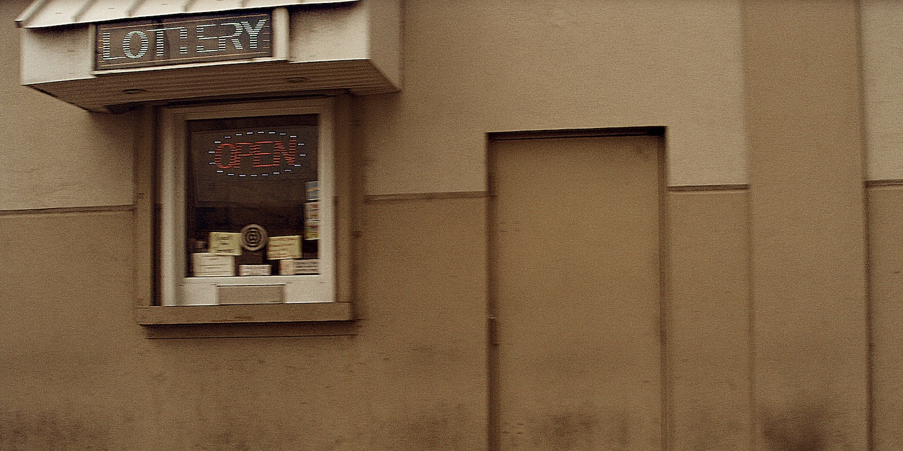

## the thrill of the game

Imagine the chance to live out your wildest dreams. Fulfillment’s a long shot but you could buy a chance. Just imagining a win is exciting. The pleasure center triggers the imagination as the thrill of the game sets in. The odds of hitting the big one are remote but imagining the power to _change everything_ makes the game fun, unless of course, one can’t afford the price of admission.

## on the street

Henry hit the streets at the end of a long journey and came to appreciate being homeless leaving his old life behind with no regrets. Life is less complicated now. A buck will buy a burger if one passes on the thought of buying a life-changing chance at the window down the street. Such a change is the last thing on Henry’s mind. He’d been there before and remembers what happened.

A burger would hit the spot ’bout now.