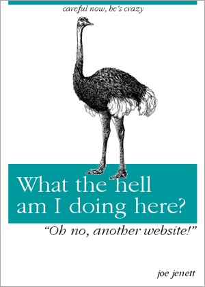

  

<a href="https://dev.to/rly" title="">Parody Book Generator</a> 😉

<h2 id="comments-title">One thought on “parody generator”		</h2>

<ol class="commentlist">
<li class="comment even thread-even depth-1 u-comment h-cite h-entry p-comment" id="li-comment-497">
<article id="comment-497" class="comment " itemprop="comment" itemscope="" itemtype="http://schema.org/Comment">
<footer>
<address class="comment-author p-author author vcard hcard h-card" itemprop="creator" itemscope="" itemtype="http://schema.org/Person">
				<cite class="fn p-name" itemprop="name"><a href="https://micro.blog/odd" rel="external nofollow ugc" class="u-url url">odd</a></cite> says:					</address>
<!-- .comment-author .vcard -->

<a href="https://micro.blog/odd/10457859"><time class="updated published dt-updated dt-published" datetime="2020-10-23T08:59:32-04:00" itemprop="datePublished dateModified dateCreated">
October 23, 2020 at 8:59 am						</time></a>

<!-- .comment-meta .commentmetadata -->
</footer>

<a href="https://micro.blog/joejenett" rel="nofollow ugc">@joejenett</a> Haha! Great!

</article></li></ol>